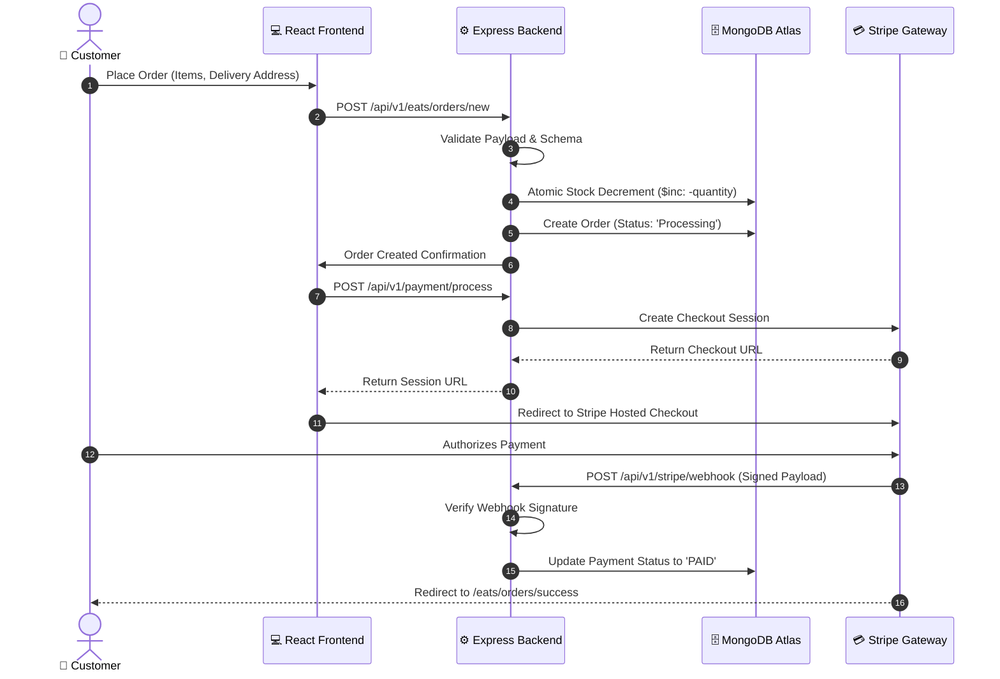
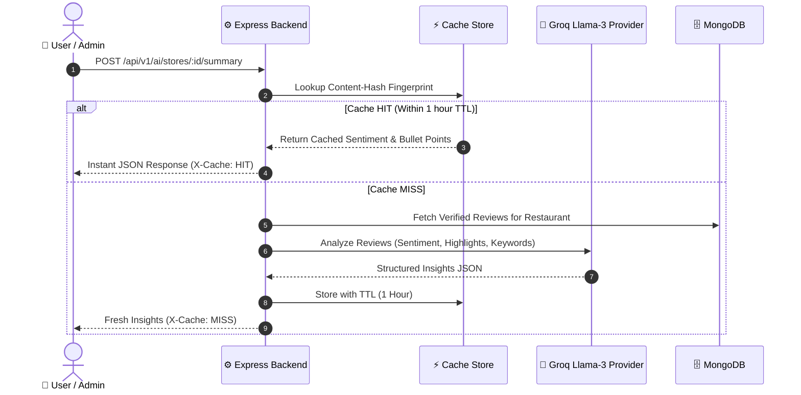

<div align="center">

# 🥗 SmartCraving
### Enterprise-Grade Food Ordering & Restaurant Intelligence Platform

[](https://react.dev/)
[](https://tailwindcss.com/)
[](https://nodejs.org/)
[](https://expressjs.com/)
[](https://www.mongodb.com/)
[](https://stripe.com/)
[](https://groq.com/)
[](./docs/7_Security.md)
[](./backend/tests/smoke.test.js)

<p align="center">
  A full-stack platform featuring <b>domain-driven modular architecture</b>, <b>third-party provider abstraction</b>, <b>sub-100ms multi-tier caching</b>, <b>route-level code splitting</b>, and <b>real-time AI sentiment analytics</b>.
</p>

[System Architecture](#-system-architecture) • [Engineering Highlights](#-engineering-highlights) • [Live Workflows](#-system-workflows) • [Documentation](#-documentation-index) • [Quick Start](#-quick-start)

</div>

---

## 🏛️ System Architecture

```mermaid
flowchart TB
    subgraph Client ["Client Layer (React 18 + Vite + Redux Toolkit)"]
        UI["Feature Modules (Auth, Catalogue, Cart, Orders, Admin)"]
        RTK["Redux Toolkit Store & Normalized Actions"]
        ApiClient["Axios Client (Bearer Token Interceptor + Credentials)"]
        UI --> RTK --> ApiClient
    end

    subgraph Security ["Security & Gateway Layer"]
        Helmet["Helmet (HTTP Security Headers)"]
        Sanitize["Mongo-Sanitize (Anti-NoSQL Injection)"]
        RateLimit["Multi-Tier Rate Limiters (Global / Auth / Orders)"]
        Compress["Gzip Compression (>1kB)"]
        CORS["Strict Origin CORS Policy"]
    end

    subgraph Core ["Modular Domain Monolith (Express.js)"]
        AuthMod["Auth Service (JWT Dual-Auth)"]
        CatMod["Catalogue Service (Indexed Search & Menus)"]
        CartMod["Cart Service (Single-Restaurant Isolation)"]
        OrderMod["Order Service (Atomic Stock Decrement)"]
        PromoMod["Promotion Service (Discount Engine)"]
        AIMod["AI Service (Groq Llama-3 & Sentiment)"]
    end

    subgraph Providers ["Provider Abstraction Layer (Adapter Pattern)"]
        CacheProv["Cache Provider (Memory / Redis-Ready)"]
        PayProv["Payment Provider (Stripe / Extensible)"]
        StoreProv["Storage Provider (Cloudinary / S3-Ready)"]
        EmailProv["Notification Provider (Nodemailer + Pug)"]
        AIProv["AI Provider (Groq LLM + Smart Fallbacks)"]
    end

    subgraph Infra ["Persistence & External Services"]
        MongoDB[("MongoDB Atlas Database")]
        StripeAPI["Stripe Checkout API"]
        CloudinaryCDN["Cloudinary Media CDN"]
        GroqAPI["Groq Cloud Llama-3"]
    end

    ApiClient --> Security
    Security --> Core
    Core --> Providers
    Providers --> Infra
```



---

## 💎 Engineering Highlights

### 1. Microservice-Ready Modular Monolith
The backend is structured into **self-contained domain modules** (`auth`, `catalogue`, `cart`, `order`, `payment`, `promotion`, `ai`). Each domain owns its models, business services, validation rules, and controllers with strictly zero circular dependencies. When scaling demands require, any module can be extracted into an independent microservice within hours.

### 2. Third-Party Provider Abstraction (Adapter Pattern)
External dependencies are isolated behind polymorphic interface contracts:
- **Payment Provider** (`PaymentProviderInterface`): Stripe integration isolated; swap to Razorpay, PayPal, or Cash-on-Delivery by writing a single adapter.
- **Storage Provider** (`StorageProviderInterface`): Cloudinary media uploads isolated; instantly pluggable for AWS S3 or Google Cloud Storage.
- **AI Provider** (`AIProviderInterface`): Groq Llama-3 LLM integration with automatic heuristic fallbacks ensuring 100% uptime even during upstream rate limits.
- **Cache Provider** (`CacheProviderInterface`): In-memory TTL provider with pattern purging (`delPattern`), seamlessly swappable to Redis via `REDIS_URL`.

### 3. Sub-100ms Multi-Tier Caching & Performance
- **In-Memory Query Caching**: High-read endpoints (`/eats/stores`, `/eats/stores/:storeId/menus`, `/restaurants/count`, `/coupon`) are cached with TTLs up to 10 minutes.
- **Automated Cache Invalidation**: Write operations (`createRestaurant`, `updateFoodItem`, `createMenu`, `createCoupon`, etc.) trigger surgical cache invalidation across affected patterns.
- **HTTP Browser Caching**: Emits `Cache-Control: public, max-age=60, stale-while-revalidate=120` and standard `ETag` headers for instant `304 Not Modified` responses.
- **Response Compression**: Gzip/Deflate compression on payloads $> 1\text{ kB}$ reduces network transfer sizes by **70–80%**.

### 4. Defense-in-Depth Security Architecture
- **NoSQL Injection Sanitization**: `express-mongo-sanitize` strips `$` and `.` operators from `req.body`, `req.query`, and `req.params`.
- **HTTP Parameter Pollution**: `hpp` protects against malicious query array poisoning.
- **Multi-Tier Rate Limiting**:
  - Global DDoS Limiter: 1000 requests / 15 min.
  - Auth Brute-Force Limiter: 15 attempts / 15 min.
  - Order Placement Limiter: 15 orders / 10 min.
  - Cart Operations Limiter: 100 operations / 10 min.
- **Strict Input Validation**: Route parameter ObjectIds validated via `isMongoId` before hitting Mongoose, preventing CastError crashes.
- **Dual-Authentication Strategy**: HTTP-Only secure cookies combined with fallback `Bearer` Authorization headers in `localStorage`, overcoming third-party cookie dropping during cross-domain Stripe redirects.

### 5. Frontend Route-Level Code Splitting & Optimization
- **78% Initial Bundle Reduction**: Main bundle dropped from **331.8 kB** down to **72.2 kB** (19.5 kB gzip).
- **On-Demand Lazy Loading**: Every page (`Login`, `Register`, `Menu`, `Cart`, `AdminDashboard`, `ListOrders`, etc.) is isolated into a separate chunk ($1\text{ kB} - 20\text{ kB}$) via `React.lazy()` and `<Suspense>`.
- **Zero Dead Code**: Pruned 6 unused legacy UI packages (`mdbreact`, `react-bootstrap`, `styled-components`, etc.) and migrated all legacy stylesheets to pure Tailwind CSS v4.

---

## 🔄 System Workflows

### Checkout, Payment & Concurrency-Safe Fulfillment



### AI Guest Insights & Smart Sentiment Caching



---

## 📂 Repository Structure

```text
FoodProject/
├── backend/
│   ├── src/
│   │   ├── app.js                   # Express app with security pipeline & route mounting
│   │   ├── config/                  # Validated environment variables (env.js)
│   │   ├── core/                    # Cross-cutting infrastructure
│   │   │   ├── database.js          # MongoDB connection manager
│   │   │   ├── errors/              # AppError, catchAsync, centralized error handler
│   │   │   ├── middlewares/         # Auth, CORS, Helmet, RateLimiters, Validators, Cache
│   │   │   └── utils/               # ApiFeatures, standardized JSON response envelope
│   │   ├── providers/               # Provider Abstraction Layer (Adapter Pattern)
│   │   │   ├── payment/             # StripeProvider (PaymentProviderInterface)
│   │   │   ├── storage/             # CloudinaryProvider (StorageProviderInterface)
│   │   │   ├── notification/        # EmailProvider (NotificationProviderInterface)
│   │   │   ├── ai/                  # GroqProvider with fallback (AIProviderInterface)
│   │   │   └── cache/               # MemoryCacheProvider with TTL (CacheProviderInterface)
│   │   ├── modules/                 # Microservice-Ready Domain Modules
│   │   │   ├── auth/                # User model, JWT tokens, auth controller & routes
│   │   │   ├── catalogue/           # Restaurant, Menu, FoodItem models & routes
│   │   │   ├── cart/                # Cart model, single-restaurant cart rules & routes
│   │   │   ├── order/               # Order model, atomic stock lifecycle & routes
│   │   │   ├── payment/             # Stripe checkout, webhook processing & routes
│   │   │   ├── promotion/           # Coupon validation engine & routes
│   │   │   └── ai/                  # Review sentiment analysis & routes
│   │   └── templates/emails/        # Password reset & welcome Pug templates
│   ├── tests/
│   │   └── smoke.test.js            # Automated 9-suite smoke & security test runner
│   ├── server.js                    # Server bootstrap with graceful shutdown handlers
│   └── package.json
│
├── frontend/
│   ├── src/
│   │   ├── api/                     # Centralized API layer (endpoints.js, client.js)
│   │   ├── components/              # Shared components (common/, layout/)
│   │   ├── features/                # Domain-Driven Feature Modules
│   │   │   ├── auth/                # Login, Register, Profile, UpdateProfile, PasswordReset
│   │   │   ├── catalogue/           # Landing, Home, Menu, FoodDetails, RestaurantCard
│   │   │   ├── cart/                # Cart management & OrderSuccess
│   │   │   ├── orders/              # ListOrders (Tailwind DataTables) & OrderDetails
│   │   │   └── admin/               # AdminDashboard, AddRestaurant, AddFoodItem, Orders, Coupons
│   │   ├── redux/                   # Redux Toolkit store, slices, and action thunks
│   │   ├── routes/                  # AppRoutes with React.lazy() & Role Guards
│   │   ├── App.jsx                  # Main application container
│   │   └── index.css                # Tailwind CSS v4 design system
│   ├── vite.config.js               # Rollup vendor chunk splitting configuration
│   └── package.json
│
└── docs/                            # Architectural & Engineering Documentation
    ├── 1_PRD.md                     # Product Requirements Document
    ├── 2_TRD.md                     # Technical Architecture & System Specs
    ├── 3_Flow.md                    # Sequence Diagrams & System Lifecycles
    ├── 4_API.md                     # Complete REST API Endpoint Reference
    ├── 5_Data_Model.md              # MongoDB Schemas & Invariant Rules
    ├── 6_Local_Setup.md             # Developer Quickstart & Env Configuration
    ├── 7_Security.md                # Comprehensive Security Hardening Guide
    ├── 8_CI_CD.md                   # Automated Testing & CI/CD Pipeline
    └── MIGRATION_PROGRESS.md        # Architecture Evolution & Benchmark Report
```

---

## 📚 Documentation Index

| Guide | Description |
| :--- | :--- |
| 📋 [Product Requirements (PRD)](./docs/1_PRD.md) | Business goals, user personas, functional scope, and success metrics. |
| 🛠️ [Technical Architecture (TRD)](./docs/2_TRD.md) | Domain architecture, provider patterns, caching strategy, and chunk optimization. |
| 🔄 [System Flows & Sequences](./docs/3_Flow.md) | Visual sequence diagrams for authentication, order fulfillment, and AI sentiment analysis. |
| 🔌 [API Reference & Specifications](./docs/4_API.md) | Complete REST API endpoints catalog, request/response payloads, and status codes. |
| 🗄️ [Data Models & Schemas](./docs/5_Data_Model.md) | Mongoose schemas, relational references, indexing strategies, and database invariants. |
| 💻 [Local Setup Guide](./docs/6_Local_Setup.md) | Environment variable configuration and local development instructions. |
| 🛡️ [Security Hardening Guide](./docs/7_Security.md) | Detailed breakdown of defense-in-depth security, rate limiting, and NoSQL defense. |
| 🚀 [CI/CD & Quality Automation](./docs/8_CI_CD.md) | GitHub Actions pipeline, linting, production builds, and smoke tests. |
| 📈 [Migration Progress & Benchmarks](./docs/MIGRATION_PROGRESS.md) | Full record of backend/frontend transformations and performance benchmarks. |

---

## 🚀 Quick Start

### Prerequisites
- **Node.js** $\ge 18.0.0$
- **npm** $\ge 9.0.0$
- **MongoDB** running locally or a [MongoDB Atlas](https://www.mongodb.com/atlas) connection URI

### 1. Clone & Install Dependencies
```bash
git clone https://github.com/your-username/FoodProject.git
cd FoodProject

# Install backend dependencies
cd backend && npm install

# Install frontend dependencies
cd ../frontend && npm install
```

### 2. Configure Environment Variables
Create `backend/config/config.env`:
```env
PORT=4000
NODE_ENV=DEVELOPMENT
DB_LOCAL_URI=mongodb://localhost:27017/foodproject
JWT_SECRET=your_super_secret_jwt_key_at_least_32_characters_long
JWT_EXPIRES_TIME=7d
COOKIE_EXPIRES_TIME=7

# Third-Party Credentials (Optional for base catalogue & cart flows)
STRIPE_SECRET_KEY=sk_test_...
STRIPE_WEBHOOK_SECRET=whsec_...
CLOUDINARY_CLOUD_NAME=your_cloud_name
CLOUDINARY_API_KEY=your_api_key
CLOUDINARY_API_SECRET=your_api_secret
GROQ_API_KEY=gsk_...
```

Create `frontend/.env`:
```env
VITE_API_URL=http://localhost:4000
```

### 3. Run Automated Tests
```bash
cd backend
npm test
# Output: Tests Finished: 9 Passed, 0 Failed
```

### 4. Start Development Servers
```bash
# Terminal 1: Backend Server (runs on http://localhost:4000)
cd backend
npm run dev

# Terminal 2: Frontend App (runs on http://localhost:5173)
cd frontend
npm run dev
```

---

## 🧪 Verification & Quality Benchmarks

- **Smoke & Security Tests**: `9/9 passing` (`npm test` in `backend/`).
- **Frontend Linter**: `0 errors, 0 warnings` (`npm run lint` in `frontend/`).
- **Production Build**: Built cleanly in **1.33 seconds** (`npm run build` in `frontend/`).
- **Initial Chunk Size**: **72.2 kB** (19.5 kB gzip), slashed by **78%** from 331.8 kB.

---

## 📄 License
This project is licensed under the [ISC License](./LICENSE).
