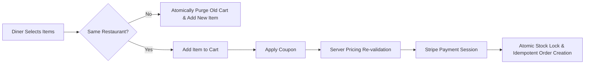

# 📋 SmartCraving Product Requirements Document (PRD)

[](#)
[](#)
[](#)

---

## 1. Stakeholder Narrative: The Contractor Brief to Engineering

> **Transcript / Context of the Commissioning Brief:**
>
> *"We are commissioning the build of **SmartCraving** because the current commercial food ordering landscape is broken for both diners and independent restaurant operators.*
> 
> *Commercial aggregators charge 25%–35% commissions, leaving local kitchens with zero profit. At the same time, existing white-label software is plagued by catastrophic operational bugs during meal-time rush hours: customers combine dishes from different kitchens causing delivery failures; two customers order the last bowl of ramen at the exact same second resulting in overselling and refund disputes; diners scroll through 500 unstructured reviews with no clue what dish is actually good; and promo code exploits allow customers to checkout below food cost.*
>
> *We need a production-grade, secure, multi-vendor food ordering and intelligence platform. We are not paying for a generic hobby clone. You must engineer strict data contracts: single-restaurant cart isolation, zero-race-condition inventory deductions, server-verified financial checkout, and an automated AI sentiment engine that digests hundreds of reviews into operational insights without racking up uncontrollable LLM API bills.*
>
> *Below is the formal contractual agreement between the Project Sponsor (Contractor) and the Engineering Team."*

---

## 2. Business Problem Analysis

### 2.1 The Diner Problem (Consumer Friction)
1. **Review Paralysis & Information Asymmetry**: Diners face hundreds of unmoderated, unstructured reviews per restaurant. They cannot quickly assess whether negative feedback stems from poor food quality, cold delivery, or rude courier service.
2. **Checkout Inconsistency & Cart Confusion**: Adding items from multiple stores creates fulfillment cross-contamination, unexpected split delivery fees, or canceled orders.
3. **Availability Disappointment**: Diners select dishes only to be notified post-payment that the kitchen is out of stock.

### 2.2 The Restaurant Operator Problem (Merchant Vulnerability)
1. **Inventory Overselling During Rush Hours**: In high-concurrency order spikes, traditional systems without atomic locks oversell inventory, forcing kitchen staff to make apologetic phone calls and process costly manual chargebacks.
2. **Promotional Margin Leaks**: Client-side discount calculations or unvalidated coupon submissions allow customers to apply expired or below-minimum-threshold discount codes.
3. **Unactionable Customer Feedback**: Kitchen managers lack the time to manually categorize reviews into actionable kitchen corrections vs packaging improvements.

### 2.3 The Platform Operator Problem (System & Financial Risk)
1. **Idempotency & Double-Charge Vulnerabilities**: Customers refreshing payment success screens or re-submitting order requests generate duplicate database records and double-deduct inventory.
2. **Unbounded Third-Party LLM Costs**: Calling LLMs dynamically on every guest review pageview creates runaway API expenses and introduces upstream latency points of failure.
3. **Security Injections**: High-throughput public endpoints are vulnerable to NoSQL query operator injections (`$gt`, `$ne`) and brute-force credential stuffing.

---

## 3. Product Solution & Value Proposition

SmartCraving solves these operational failures through an engineered **modular monolith platform**:

```
┌─────────────────────────────────────────────────────────────────────────────┐
│                             SMARTCRAVING PLATFORM                           │
├─────────────────────┬───────────────────────────┬───────────────────────────┤
│  DISCOVERY & INTEL  │     INTEGRITY & CART      │    FULFILLMENT & SCALE    │
│  • Full-Text Search │ • Single-Store Isolation  │ • Atomic $inc Decrement   │
│  • Aspect Sentiment │ • Real-Time Stock Bounds  │ • Stripe Cryptographic Id │
│  • Fast Hash Caching│ • Re-validated Discounts  │ • Zero-Duplicate Orders   │
└─────────────────────┴───────────────────────────┴───────────────────────────┘
```

1. **For Diners**: Instant dish discovery (< 50ms read latency), clear single-restaurant cart boundaries, guaranteed stock allocation, and Groq Llama-3 AI summaries highlighting true guest sentiment.
2. **For Restaurant Owners**: Absolute inventory consistency with zero overselling, self-serve catalog management, and automated sentiment analysis clustering customer praise and complaints.
3. **For Platform Operators**: Server-enforced financial validation, defense-in-depth security, and sub-100ms multi-tier caching with content-hash LLM deduplication.

---

## 4. Contractual Scope & Target Personas

| Persona | Authentication Scope | Contracted Responsibilities & Privileges |
| :--- | :--- | :--- |
| **Guest / Diner** | Public (Unauthenticated) | Search catalog, filter by diet/rating, view food items and menus, read AI-generated sentiment summaries. |
| **Customer (`user`)** | JWT (Cookie / Bearer) | Manage profile, add items to single-restaurant cart, apply coupons, complete Stripe checkout, view order history, submit dish reviews. |
| **Administrator (`admin`)** | High-Privilege JWT | Create/Edit/Delete restaurants, manage menu categories, upload food images, transition order states (`Processing` $\rightarrow$ `Dispatched` $\rightarrow$ `Delivered` $\rightarrow$ `Cancelled`), issue coupon codes. |

> **Contract Rule**: All public registrations are strictly assigned `role: "user"`. Admin elevation requires direct database intervention.

---

## 5. Core System Invariants & Functional Contracts

Engineering deliverables must strictly honor the following **non-negotiable system contracts**:



### 5.1 Cart Invariant: Single-Restaurant Isolation Contract
* **Rule**: A customer cart must never contain items from more than one restaurant concurrently.
* **Contract Specification**:
  $$\forall i, j \in \text{Cart.items}, \quad \text{Restaurant}(i) = \text{Restaurant}(j)$$
* **Behavior**: If an authenticated customer adds an item from Restaurant $B$ while their cart contains items from Restaurant $A$, the system must atomically flush Restaurant $A$'s items and populate the cart exclusively with the item from Restaurant $B$.

### 5.2 Inventory Invariant: Atomic Decrement Contract
* **Rule**: Stock overselling is unacceptable. Inventory must be decremented atomically upon confirmed payment.
* **Contract Specification**:
  $$\text{Stock}_{\text{new}} = \text{Stock}_{\text{current}} - \text{Quantity}_{\text{purchased}} \quad \text{where} \quad \text{Stock}_{\text{current}} \ge \text{Quantity}_{\text{purchased}}$$
* **Implementation Requirement**: Stock deductions must execute via atomic MongoDB `$inc` operators with filter conditions (`stock: { $gte: quantity }`).
* **Rollback Requirement**: If an order status changes to `Cancelled`, the system must automatically restore deducted stock via atomic increment.

### 5.3 Financial Invariant: Server-Revalidated Pricing Contract
* **Rule**: No client-side price, subtotal, or discount calculation shall ever be accepted by the payment gateway.
* **Contract Specification**:
  * The backend must fetch fresh item prices directly from the database at checkout creation.
  * Coupon validity (expiration date, minimum spend, discount percentage, and `maxDiscount` cap) must be re-evaluated strictly on the server before dispatching to Stripe.
  * Formula:
    $$\text{FinalAmount} = \max\left(0, \sum (p_i \times q_i) - \min(\text{CalculatedDiscount}, \text{Coupon.maxDiscount})\right)$$

### 5.4 Idempotency Invariant: Deduplicated Order Fulfillment
* **Rule**: Order fulfillment endpoints must prevent double-booking on page refreshes or network retries.
* **Contract Specification**:
  * Each completed order is bound to a unique `stripeSessionId`.
  * If a request is received with an existing `stripeSessionId`, the system returns the existing order record without re-deducting stock or creating duplicate entries.

### 5.5 AI Reliability Invariant: Content-Hash LLM Caching & Fallback Contract
* **Rule**: The platform must never fail a page load due to upstream LLM downtime, nor repeatedly call the LLM for unchanged reviews.
* **Contract Specification**:
  * Calculate an MD5 hash of all approved restaurant reviews:
    $$\text{CacheKey} = \text{store}:\langle\text{id}\rangle:\text{MD5}(\text{Reviews})$$
  * Serve cached sentiment directly if `CacheKey` exists in memory (1-hour TTL).
  * If Groq Llama-3 returns rate limits (429) or 5xx, the system must transparently fall back to rule-based heuristic sentiment scoring, maintaining a 100% uptime SLA.

---

## 6. Security & Architectural Invariants

Engineering must maintain the following architectural boundaries:

1. **Provider Abstraction (Adapter Pattern)**:
   * External integrations (Stripe, Cloudinary, Groq AI, Nodemailer, In-Memory/Redis Cache) must reside behind abstract provider interfaces (`PaymentProviderInterface`, `AIProviderInterface`, `StorageProviderInterface`, `CacheProviderInterface`) to prevent vendor lock-in.
2. **Defense-in-Depth Gateway**:
   * **NoSQL Injection Defense**: `express-mongo-sanitize` strips `$` and `.` operators from all incoming requests.
   * **Parameter Pollution**: `hpp` protects query arrays.
   * **Tiered Rate Limiting**: Global DDOS limiter (1000 req / 15 min), Auth endpoint brute-force limiter (15 req / 15 min), Order creation limiter (30 req / 15 min).
3. **Data Immutability on Orders**:
   * When an order is placed, item details (`name`, `price`, `image`) must be cloned into the order document. Future updates or deletions to menu items must never corrupt historical financial receipts.

---

## 7. Service Level Objectives (SLOs) & Agreed Terms

The contractor and engineering team agree to the following verifiable metrics:

| Metric | Target SLA | Verification Method |
| :--- | :--- | :--- |
| **Catalog Cached Read Latency** | $< 50\text{ ms}$ | Benchmarked via `/api/v1/eats/stores` with in-memory TTL cache |
| **Catalog Uncached Read Latency** | $< 120\text{ ms}$ | Indexed MongoDB compound query with projection |
| **Client Initial Bundle Size** | $< 100\text{ kB}$ (gzip) | Vite build report with route-level lazy loading (Verified: 72.2 kB) |
| **Inventory Concurrency Integrity** | $0\%$ oversell rate | Concurrency tests using atomic `$inc` with boundary checks |
| **Critical Smoke Test Suite** | $100\%$ pass rate | Automated smoke test runner (`backend/tests/smoke.test.js`) |
| **NoSQL Injection Resistance** | $100\%$ sanitization | Security test payload verification |

---

## 8. Acceptance Criteria Matrix

| Feature | Condition / Action | Expected Result (Contract Fulfillment) |
| :--- | :--- | :--- |
| **Multi-Store Conflict** | User with items from Store A clicks "Add" on Store B item | Cart replaces Store A items with Store B item without server crash or cart corruption. |
| **Stock Boundary** | User attempts to order quantity > available stock | Request rejected with 400 Bad Request: "Requested quantity exceeds available stock". |
| **Coupon Cap** | User applies 50% coupon on \$200 order where `maxDiscount` = \$30 | Final discount applied is exactly \$30, not \$100. |
| **Duplicate Webhook / Success Refresh** | User refreshes `/eats/orders/success?session_id=...` 5 times | Exactly one order is created; stock is decremented exactly once; subsequent calls return existing order. |
| **AI LLM Outage** | Groq API responds with 429 Too Many Requests | Controller catches error, applies heuristic scoring, returns valid sentiment payload with fallback status. |
| **Admin Authorization** | Standard user attempts `POST /api/v1/eats/item` | Gateway rejects with 403 Forbidden: "User role user is not authorized to access this route". |
