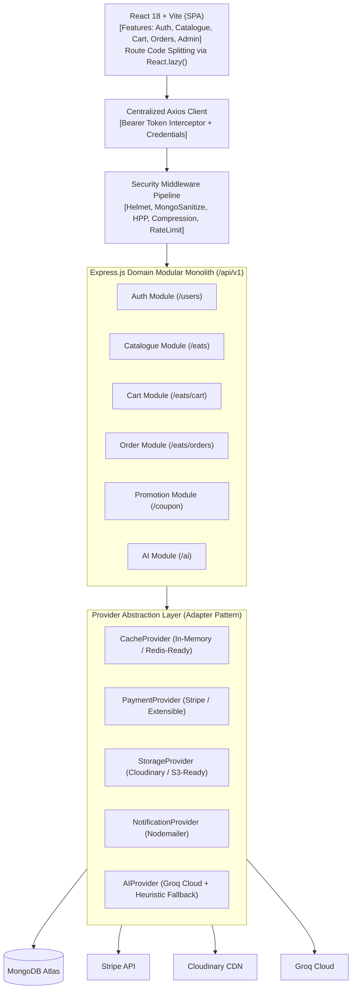
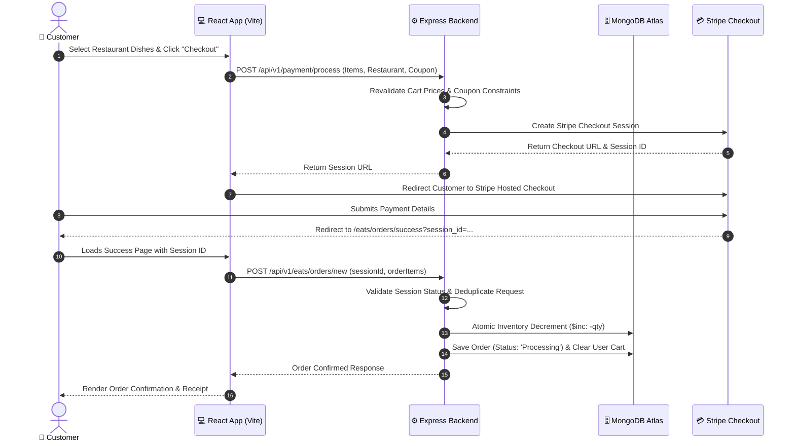
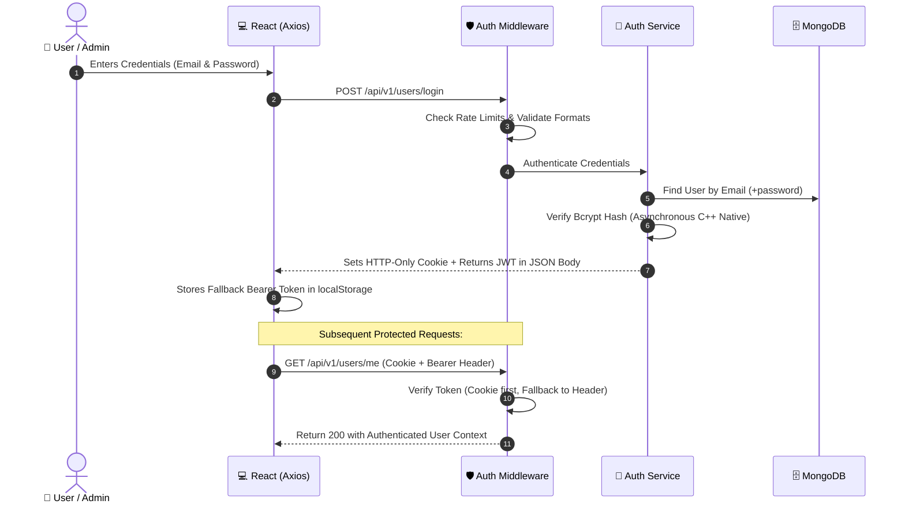
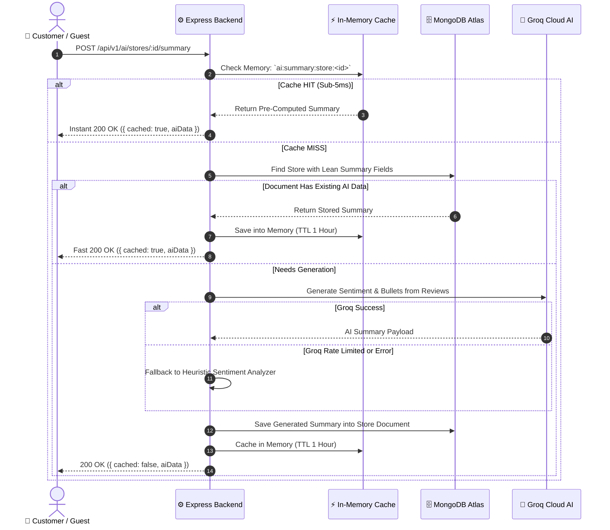
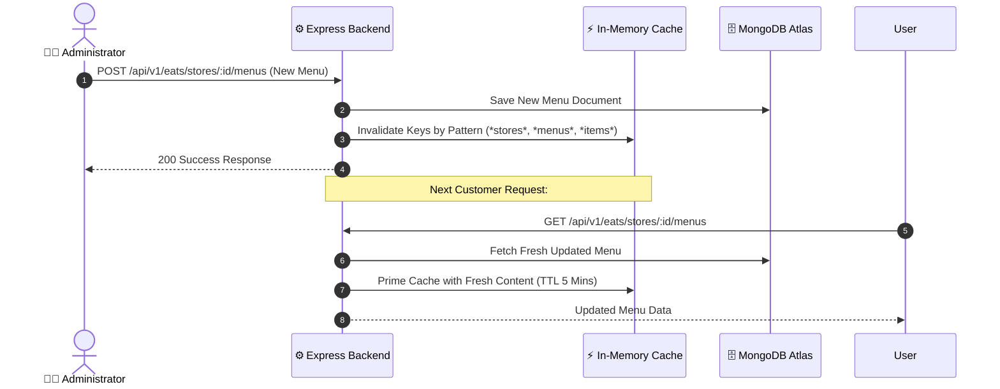

# SmartCraving — System Architecture & Flows

## 1. System Topology & Architecture

SmartCraving is engineered as a **modular domain monolith** on the backend paired with a high-performance **React Single-Page Application (SPA)** on the frontend.



---

## 2. Technology Stack Specifications

| Layer | Technology | Purpose & Rationale |
| :--- | :--- | :--- |
| **Frontend Framework** | React 18 + Vite 5 | Fast Hot Module Replacement (HMR), optimized ESM production builds. |
| **State Management** | Redux Toolkit | Centralized predictable state container for cart, auth, and restaurant data. |
| **Styling** | Tailwind CSS v4 | Utility-first responsive design with minimal bundle footprint. |
| **Routing** | React Router v6 | Declarative client routing with dynamic route-level lazy loading (`React.lazy`). |
| **Backend Runtime** | Node.js (v20) + Express 4 | High-throughput asynchronous event loop with modular route architecture. |
| **Database** | MongoDB Atlas + Mongoose 7 | Flexible document storage with atomic `$inc` operators and compound indexes. |
| **Third-Party Providers** | Decoupled Adapters | Stripe (Payments), Cloudinary (Images), Groq (AI Insights), Nodemailer (Emails). |

---

## 3. Provider Abstraction Layer (Adapter Pattern)

All third-party services are decoupled behind interface contracts in `backend/src/providers/`. This prevents vendor lock-in and allows seamless swapping of underlying cloud providers:

```text
backend/src/providers/
├── cache/
│   ├── cache.interface.js       # get, set, del, delByPattern, flush
│   ├── memory.provider.js       # In-memory Map with automatic TTL & maxEntries
│   └── index.js                 # Factory singleton (pluggable for Redis)
├── payment/
│   ├── payment.interface.js     # createCheckoutSession, verifyWebhookSignature
│   ├── stripe.provider.js       # Stripe SDK implementation
│   └── index.js                 # Pluggable for Razorpay / PayPal
├── storage/
│   ├── storage.interface.js     # uploadImage, deleteImage
│   ├── cloudinary.provider.js   # Cloudinary v2 implementation
│   └── index.js                 # Pluggable for AWS S3 / GCS
├── notification/
│   ├── notification.interface.js# sendPasswordReset, sendWelcome
│   ├── email.provider.js        # Nodemailer provider
│   └── index.js                 # Pluggable for SendGrid / SES
└── ai/
    ├── ai.interface.js          # generateDishMetadata, analyzeReviews
    ├── groq.provider.js         # Groq LLM with smart heuristic fallbacks
    └── index.js
```

---

## 4. Frontend Route Splitting & Chunk Optimization

To ensure fast first-paint times, the frontend lazily loads all feature views inside `AppRoutes.jsx`:

```javascript
const Home = lazy(() => import("../features/catalogue/Home"));
const Menu = lazy(() => import("../features/catalogue/Menu"));
const Cart = lazy(() => import("../features/cart/Cart"));
const AdminDashboard = lazy(() => import("../features/admin/AdminDashboard"));
```

### Rollup Manual Chunk Partitioning (`vite.config.js`)
External dependencies are partitioned into dedicated vendor chunks:
- `vendor`: React, React-DOM, React Router, Axios
- `redux`: `@reduxjs/toolkit`, `react-redux`
- `icons`: `react-icons`
- `utils`: UI helper libraries and formatters

**Production Build Results**:
- Main entry chunk: **~72.9 kB** (~19.7 kB gzip).
- Users only download code for the page they are actively visiting.

---

## 5. System Sequence Diagrams

### 5.1 End-to-End Order & Payment Flow



### 5.2 Authentication & Dual-Auth Strategy Flow



### 5.3 In-Memory Cached AI Review Summary Flow



### 5.4 Catalogue Invalidation Flow


