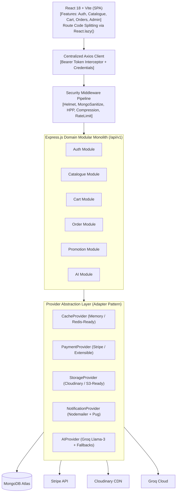

# 🛠️ SmartCraving Technical Requirements Document (TRD)

[](#)
[](#)

---

## 1. System Topology & Architecture



---

## 2. Technology Stack Specifications

| Layer | Component | Choice | Rationale |
| :--- | :--- | :--- | :--- |
| **Frontend UI** | Framework | React 18 + Vite 5 | Fast HMR, optimized ESM builds, and native concurrent features. |
| **State Management** | State Store | Redux Toolkit | Predictable state container with normalized action thunks and slices. |
| **Styling** | Design System | Tailwind CSS v4 | High performance utility-first CSS with 0 runtime overhead. |
| **Routing & Chunking**| Router | React Router v6 | Declarative route structure with dynamic `React.lazy()` per-page chunks. |
| **Backend Runtime** | Application Engine | Node.js (v20) + Express 4 | High-throughput asynchronous event loop with clean modular routing. |
| **Data Persistence** | Primary Database | MongoDB + Mongoose 7 | Flexible document model with atomic `$inc` operators and schema indexing. |
| **Third-Party Providers** | Decoupled Adapters | Stripe, Cloudinary, Groq, Nodemailer | Encapsulated behind standard interfaces for vendor-agnostic extensibility. |

---

## 3. Provider Abstraction Layer (Adapter Pattern)

All third-party SDKs are isolated behind interface contracts in `backend/src/providers/`:

```text
backend/src/providers/
├── cache/
│   ├── cache.interface.js       # get, set, del, delPattern, flush
│   ├── memory.provider.js      # In-memory Map with automatic TTL & maxEntries
│   └── index.js                 # Factory singleton (pluggable for Redis)
├── payment/
│   ├── payment.interface.js     # createCheckoutSession, verifyWebhookSignature
│   ├── stripe.provider.js       # Stripe SDK implementation
│   └── index.js                 # Pluggable for Razorpay / PayPal
├── storage/
│   ├── storage.interface.js     # uploadImage, deleteImage
│   ├── cloudinary.provider.js   # Cloudinary v2 implementation
│   └── index.js                 # Pluggable for AWS S3 / GCS
├── notification/
│   ├── notification.interface.js# sendPasswordReset, sendWelcome
│   ├── email.provider.js        # Nodemailer + Pug template renderer
│   └── index.js                 # Pluggable for SendGrid / Twilio
└── ai/
    ├── ai.interface.js          # generateDishMetadata, analyzeReviews
    ├── groq.provider.js         # Groq Llama-3 with smart heuristic fallbacks
    └── index.js
```

---

## 4. Frontend Route-Level Code Splitting & Performance

The frontend eliminates monolithic initial loading by lazily importing all route components inside [`AppRoutes.jsx`](file:///home/nilaydawn/Desktop/WebDevProj/FoodProject/frontend/src/routes/AppRoutes.jsx):

```javascript
// Example: Isolated On-Demand Loading
const Home = lazy(() => import("../features/catalogue/Home"));
const Menu = lazy(() => import("../features/catalogue/Menu"));
const Cart = lazy(() => import("../features/cart/Cart"));
const AdminDashboard = lazy(() => import("../features/admin/AdminDashboard"));
```

### Rollup Manual Chunk Partitioning (`vite.config.js`):
- `vendor`: React, React-DOM, React Router, Axios
- `redux`: `@reduxjs/toolkit`, `react-redux`
- `icons`: `react-icons`
- `utils`: UI helper libraries and data formatters

**Benchmark Result**:
- Initial entry chunk reduced from **331.8 kB** to **72.2 kB** (19.5 kB gzip) — a **78% reduction**.

---

## 5. Security Architecture

1. **Helmet HTTP Headers**: Configures `X-Content-Type-Options: nosniff`, `X-Frame-Options: SAMEORIGIN`, and DNS prefetch controls.
2. **Anti-NoSQL Injection**: `express-mongo-sanitize` scrubs `$` and `.` operators from `req.body`, `req.query`, and `req.params`.
3. **HTTP Parameter Pollution**: `hpp` blocks parameter array attacks on query filters.
4. **Multi-Tier Rate Limiting**:
   - Global API limiter (1000 req / 15 min).
   - Auth endpoints limiter (15 req / 15 min).
   - Order creation limiter (15 req / 10 min).
   - Cart operations limiter (100 req / 10 min).
5. **Strict Input Validation**: Route parameter ObjectIds checked via `isMongoId` before hitting the database driver.
