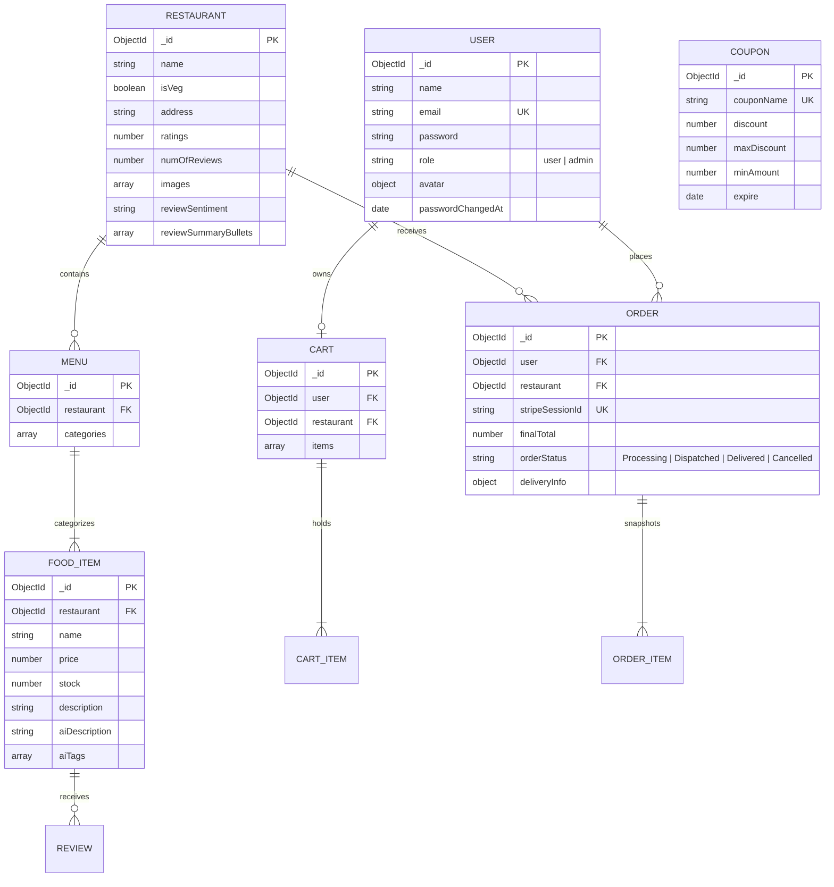

# SmartCraving — API Reference & Data Models

## 1. API Architecture & Standards

- **Base URL**: `/api/v1`
- **Payload Format**: `application/json`
- **Security Pipeline**: All routes pass through Helmet, `express-mongo-sanitize`, `hpp`, and route-specific rate limiters.

### Standard Response Envelopes

**Success Envelope**:
```json
{
  "status": "success",
  "data": { ... }
}
```

**Operational Error Envelope**:
```json
{
  "status": "fail",
  "message": "Descriptive error message",
  "errMessage": "Descriptive error message"
}
```

---

## 2. Complete REST API Reference

### 2.1 Authentication & User Management (`/api/v1/users`)

| Method | Endpoint | Access | Rate Limit | Description |
| :--- | :--- | :---: | :---: | :--- |
| `POST` | `/signup` | Public | 6 / 15m | Register new customer account & issue JWT. |
| `POST` | `/login` | Public | 6 / 15m | Authenticate with email & password, issue JWT. |
| `GET` | `/logout` | Public | — | Clear authentication cookie. |
| `POST` | `/forgetPassword` | Public | 5 / 15m | Send password reset token to user email. |
| `PATCH`| `/resetPassword/:token` | Public | 5 / 15m | Set new password using reset token. |
| `GET` | `/me` | User | — | Get authenticated profile data. |
| `PUT` | `/me/update` | User | — | Update name, email, or profile avatar. |
| `PUT` | `/password/update` | User | — | Update account password. |

### 2.2 Catalogue & Menus (`/api/v1/eats`)

*Public read routes are exempt from strict global rate limiting and served from in-memory cache.*

| Method | Endpoint | Access | Caching | Description |
| :--- | :--- | :---: | :---: | :--- |
| `GET` | `/restaurants/count` | Public | 10m TTL | Total count of registered restaurants. |
| `GET` | `/stores` | Public | 5m TTL | Search and list restaurants (filters: search, sort, isVeg). |
| `POST` | `/stores` | Admin | Invalidate | Register a new restaurant. |
| `GET` | `/stores/:storeId` | Public | 5m TTL | Get restaurant details by ID. |
| `DELETE`| `/stores/:storeId` | Admin | Invalidate | Delete restaurant and its menus. |
| `GET` | `/stores/:storeId/menus` | Public | 5m TTL | Get menu categories and dishes for a restaurant. |
| `POST` | `/stores/:storeId/menus` | Admin | Invalidate | Create a new menu category for a restaurant. |
| `DELETE`| `/stores/:storeId/menus/:menuId` | Admin | Invalidate | Delete a menu category. |
| `POST` | `/item` | Admin | Invalidate | Create a new food dish. |
| `GET` | `/items/:storeId` | Public | 5m TTL | Fetch all dishes belonging to a restaurant. |
| `GET` | `/item/:foodId` | Public | 5m TTL | Fetch dish details and reviews. |
| `PATCH`| `/item/:foodId` | Admin | Invalidate | Update dish details or stock quantity. |
| `DELETE`| `/item/:foodId` | Admin | Invalidate | Delete dish. |
| `PUT` | `/item/:foodId/review` | User | 20 / 15m | Submit a rating and review for a dish. |

### 2.3 Cart Operations (`/api/v1/eats/cart`)

| Method | Endpoint | Access | Rate Limit | Description |
| :--- | :--- | :---: | :---: | :--- |
| `POST` | `/add-to-cart` | User | — | Add dish to cart (enforces single-restaurant rule). |
| `POST` | `/update-cart-item` | User | — | Increment or decrement item quantity ($1 \le \text{qty} \le 50$). |
| `DELETE`| `/delete-cart-item` | User | — | Remove dish from cart. |
| `GET` | `/get-cart` | User | — | Fetch current user cart items and pricing. |

### 2.4 Orders & Fulfillment (`/api/v1/eats/orders`)

| Method | Endpoint | Access | Rate Limit | Description |
| :--- | :--- | :---: | :---: | :--- |
| `POST` | `/new` | User | — | Finalize verified order post-payment. |
| `GET` | `/me/myOrders` | User | — | Get order history for logged-in user. |
| `GET` | `/:id` | User | — | Get single order details with item snapshots. |
| `GET` | `/admin` | Admin | — | List all system orders. |
| `PATCH`| `/:id/status` | Admin | — | Update order stage (`Processing`, `Dispatched`, `Delivered`, `Cancelled`). |

### 2.5 Payments (`/api/v1`)

| Method | Endpoint | Access | Rate Limit | Description |
| :--- | :--- | :---: | :---: | :--- |
| `POST` | `/payment/process` | User | 20 / 15m | Re-validates cart items & coupons, creates Stripe Checkout session. |
| `GET` | `/stripeapi` | User | — | Returns Stripe publishable key to client. |
| `POST` | `/stripe/webhook` | Stripe | — | Webhook listener verifying Stripe signature. |

### 2.6 Promotions & Coupons (`/api/v1/coupon`)

| Method | Endpoint | Access | Rate Limit | Description |
| :--- | :--- | :---: | :---: | :--- |
| `GET` | `/` | Public | 5m TTL | List active promotional coupons. |
| `POST` | `/validate` | User | 60 / 15m | Validates coupon code and calculates discount (in-memory cached). |
| `POST` | `/` | Admin | Invalidate | Create a new promotional coupon. |
| `PATCH`| `/:couponId` | Admin | Invalidate | Update coupon fields or expiration. |
| `DELETE`| `/:couponId` | Admin | Invalidate | Delete coupon. |

### 2.7 AI Review Summaries (`/api/v1/ai`)

| Method | Endpoint | Access | Rate Limit | Description |
| :--- | :--- | :---: | :---: | :--- |
| `POST` | `/stores/:id/summary` | User | Skipped (Cache) | Get cached AI review summary & sentiment for a restaurant. |
| `POST` | `/items/:id/summary` | User | Skipped (Cache) | Get cached AI review summary & sentiment for a dish. |
| `POST` | `/generate-food` | Admin | 30 / 15m | Generate AI description and tags for a dish. |

---

## 3. Database Entity-Relationship Diagram (ERD)



---

## 4. Schemas & Performance Indexing

### 4.1 `User` Model
- **Indexes**: `{ email: 1 }` (unique, lowercase, trimmed).
- **Security**: Password hashed using asynchronous native `bcrypt` (salt rounds = 10) with `select: false` by default.

### 4.2 `Restaurant` Model
- **Text Search Index**: `{ name: "text", address: "text" }` for fuzzy search.
- **Compound Performance Indexes**:
  - `{ ratings: -1, numOfReviews: -1 }` (for high-traffic ranking).
  - `{ name: 1 }` (for alphabetical store browsing).
  - `{ isVeg: 1 }` (for diet-specific filtering).

### 4.3 `FoodItem` Model
- **Compound Indexes**: `{ restaurant: 1, name: 1 }` for rapid menu retrieval.
- **Stock Constraint**: `stock >= 0`. Stock updates execute via conditional `$inc` operators.

### 4.4 `Order` Model
- **Compound Performance Index**: `{ user: 1, createdAt: -1 }` for instant customer order history (`/myOrders`).
- **Unique Idempotency Index**: `{ stripeSessionId: 1 }` (sparse, unique) to prevent duplicate order generation.

### 4.5 `Coupon` Model
- **Compound Performance Indexes**:
  - `{ couponName: 1, expire: 1 }` for index-covered checkout validation.
  - `{ expire: 1 }` for expiration queries.
