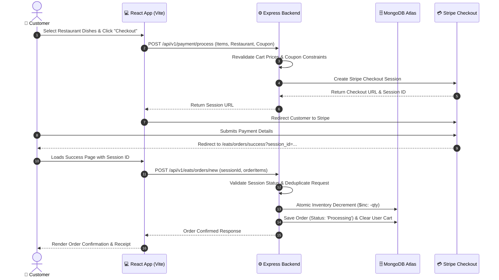
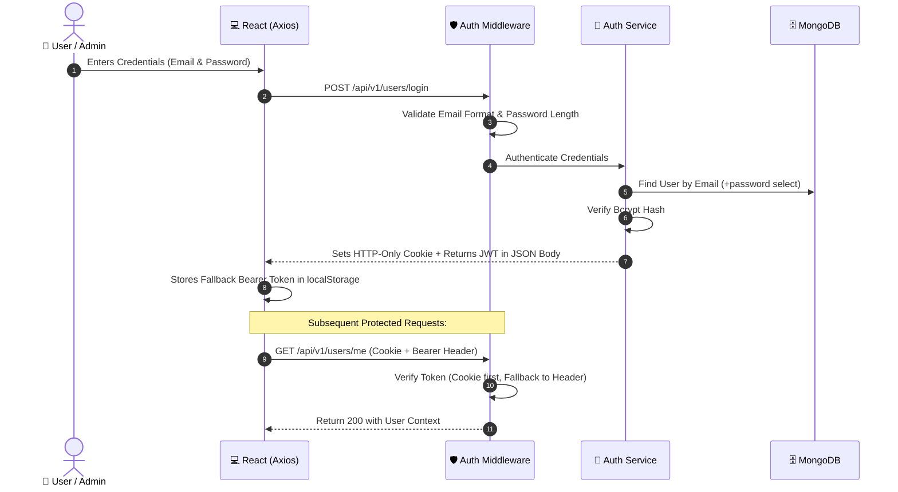
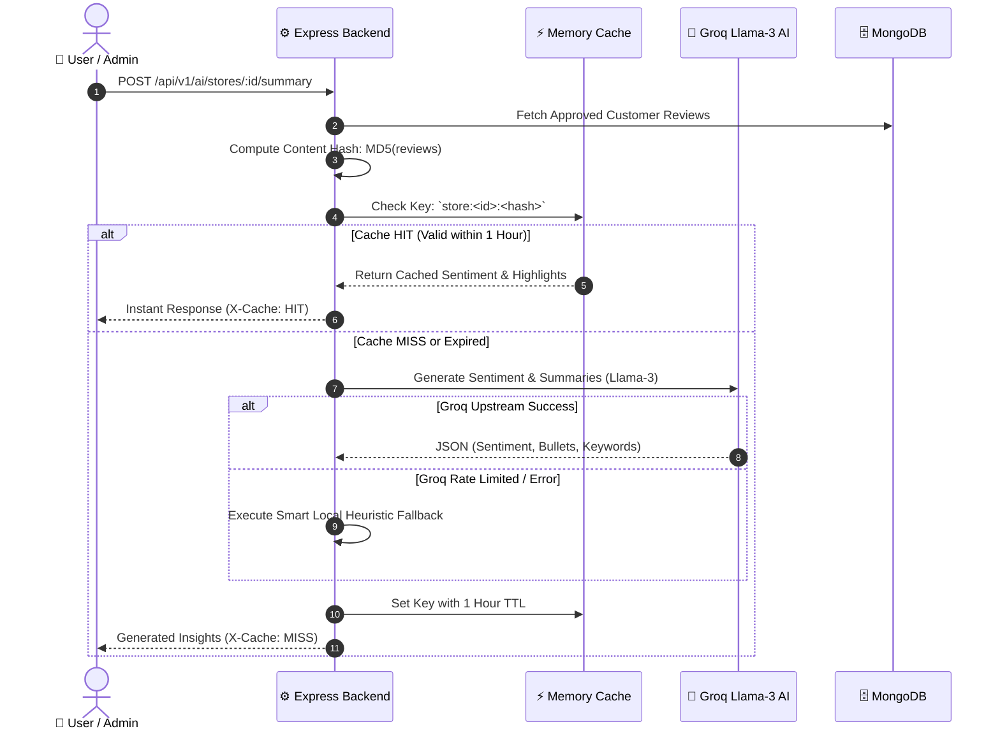
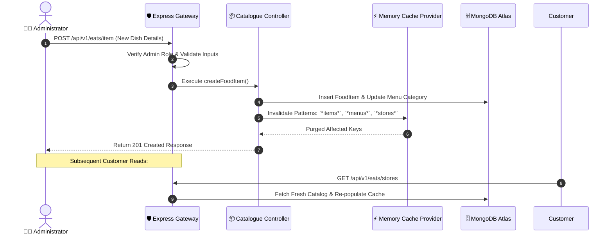

# 🔄 SmartCraving System Flows & Sequence Diagrams

---

## 1. End-to-End Customer Order & Payment Flow

---

## 2. Authentication & Dual-Auth Strategy Flow

---

## 3. AI Sentiment Analysis with Content-Hash Caching

---

## 4. Admin Catalog Write & Cache Invalidation Flow

