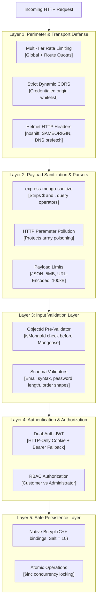
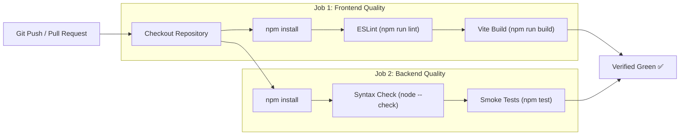

# SmartCraving — Setup, Security & CI/CD Guide

## 1. Local Development Setup Guide

### 1.1 Prerequisites
- **Node.js**: $\ge 18.0.0$ (LTS recommended)
- **MongoDB**: Local MongoDB instance (`mongod`) or a [MongoDB Atlas](https://www.mongodb.com/atlas) connection URI.
- **Git**

---

### 1.2 Installation Steps

#### Step 1: Clone Repository
```bash
git clone https://github.com/your-username/FoodProject.git
cd FoodProject
```

#### Step 2: Configure & Start Backend
```bash
cd backend
npm install
```

Create or verify `backend/src/config/config.env`:
```env
PORT=4000
NODE_ENV=DEVELOPMENT
DB_LOCAL_URI=mongodb://127.0.0.1:27017/foodproject
JWT_SECRET=super_secure_jwt_secret_key_minimum_32_chars
JWT_EXPIRE=90d
JWT_COOKIE_EXPIRES_DAYS=90
FRONTEND_URL=http://localhost:5173

# Optional: Stripe Payments (for checkout testing)
STRIPE_SECRET_KEY=sk_test_...
STRIPE_API_KEY=pk_test_...

# Optional: Cloudinary Media Storage (for image uploads)
CLOUDINARY_CLOUD_NAME=
CLOUDINARY_API_KEY=
CLOUDINARY_API_SECRET=

# Optional: Groq Cloud AI (for dish and review insights)
GROQ_API_KEY=gsk_...
GROQ_MODEL=openai/gpt-oss-20b

# Optional: Email Service
EMAIL_HOST=smtp.gmail.com
EMAIL_PORT=587
EMAIL_USERNAME=your_email@gmail.com
EMAIL_PASSWORD=your_app_password
EMAIL_FROM="SmartCraving <no-reply@smartcraving.com>"
```

#### Step 3: Populate Sample Data (Optional)
```bash
npm run seeder
```

#### Step 4: Run Verification Tests
```bash
npm test
# Output: Tests Finished: 10 Passed, 0 Failed
```

#### Step 5: Start Backend Development Server
```bash
npm run dev
# Server running on port 4000 in DEVELOPMENT mode
```

---

### 1.3 Configure & Start Frontend

```bash
cd ../frontend
npm install
```

Create `frontend/.env`:
```env
VITE_API_URL=http://localhost:4000
```

Start the frontend development server:
```bash
npm run dev
# Local app runs on http://localhost:5173
```

---

## 2. Security Architecture (Defense-in-Depth)

SmartCraving enforces a 5-layer defense pipeline on every incoming request:



---

### 2.1 Defense-in-Depth Mitigations

1. **NoSQL Injection Defense**:
   `express-mongo-sanitize` strips `$` and `.` operators from `req.body`, `req.query`, and `req.params`. Payloads like `{ "email": { "$gt": "" } }` are completely neutralized.
2. **Strict Parameter Validation**:
   `validateObjectId` runs before database access. Malformed hexadecimal strings immediately return `400 Bad Request` rather than triggering driver exceptions.
3. **Dual-Auth Token Architecture**:
   Issues signed JWTs in `httpOnly`, `secure` (in production), and `sameSite` cookies to prevent XSS exfiltration. For external redirects (e.g. Stripe checkout return), the frontend Axios client falls back to an `Authorization: Bearer <token>` header.
4. **Role-Based Access Control (RBAC)**:
   All administrative actions (`/admin/*`, restaurant/dish writes) strictly require the `authorizeRoles("admin")` middleware.
5. **Inventory Concurrency Protection**:
   Stock deductions execute using conditional `$gte` queries with atomic `$inc`:
   ```javascript
   FoodItem.findOneAndUpdate(
     { _id: item.foodItemId, stock: { $gte: item.quantity } },
     { $inc: { stock: -item.quantity } }
   );
   ```

---

### 2.2 Rate Limiter Configuration

| Rate Limiter | Route Target | Limit Window | Quota | Special Rules |
| :--- | :--- | :---: | :---: | :--- |
| `globalLimiter` | `/api/*` | 15 mins | 10,000 reqs | Skips public cached catalogue (`/eats/*`, `/coupon/`, `/health`). |
| `authAttemptLimiter` | `/api/v1/users/login`, `/signup` | 15 mins | 6 reqs | Protects against credential brute-forcing. |
| `passwordResetLimiter`| `/api/v1/users/forgetPassword` | 15 mins | 5 reqs | Mitigates email spamming. |
| `paymentLimiter` | `/api/v1/payment/process` | 15 mins | 20 reqs | Guards checkout session creation. |
| `couponValidationLimiter`| `/api/v1/coupon/validate` | 15 mins | 60 reqs | Comfortably allows cart recalculations. |
| `aiLimiter` | `/api/v1/ai/*` | 15 mins | 30 reqs | Skips cached read endpoints (`/summary`). |
| `reviewLimiter` | `/api/v1/eats/item/:id/review` | 15 mins | 20 reqs | Prevents review spamming. |

---

## 3. CI/CD & Quality Automation

Automated testing runs on every **Push** and **Pull Request** targeting the `main` branch via GitHub Actions (`.github/workflows/ci.yml`).



### Pre-Commit Checks

Run these commands locally prior to committing:

```bash
# Frontend checks
cd frontend
npm run lint
npm run build

# Backend checks
cd ../backend
npm test
```
