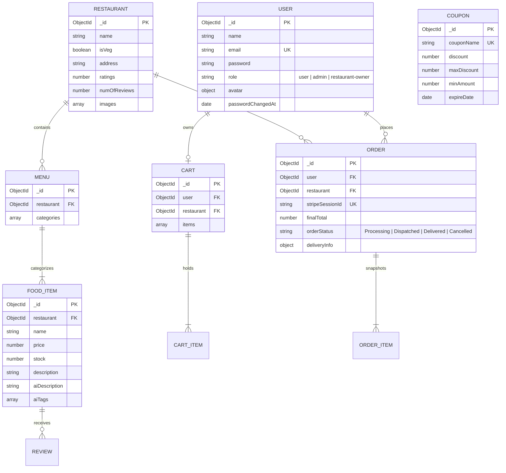

# 🗄️ SmartCraving Data Model & Schema Invariants

---

## 1. Entity-Relationship Diagram (ERD)

---

## 2. Collection Schemas & Indexing Strategies

### 2.1 `User`
- **Unique Indexes**: `email` (lowercase, trimmed).
- **Security Invariant**: `password` is hashed using `bcryptjs` with salt rounds = 10 and has `select: false` by default.

### 2.2 `Restaurant`
- **Text Index**: `{ name: "text", address: "text" }` for high-speed multi-term fuzzy matching.
- **Geo Index**: `location: "2dsphere"` for geospatial radius queries.

### 2.3 `FoodItem`
- **Compound Indexes**: `{ restaurant: 1, name: 1 }` for high-throughput menu browsing.
- **Inventory Invariant**: `stock >= 0`. Stock updates are performed via atomic `$inc` operators.

### 2.4 `Cart`
- **Unique Index**: `{ user: 1 }` ensuring one active cart per customer.
- **Single-Restaurant Invariant**: If a customer adds an item with `restaurant_id !== cart.restaurant_id`, existing items are atomically cleared.

### 2.5 `Order`
- **Unique Index**: `stripeSessionId` prevents duplicate order records on checkout success page refreshes.
- **Data Immobility Invariant**: Order items snapshot `name`, `price`, and `image` at the time of purchase so historical receipts are unaffected by future menu edits.

### 2.6 `Coupon`
- **Unique Index**: `couponName` (uppercase, alphanumeric).
- **Discount Invariant**: Calculated discount cannot exceed `maxDiscount` and requires cart total $\ge \text{minAmount}$.
