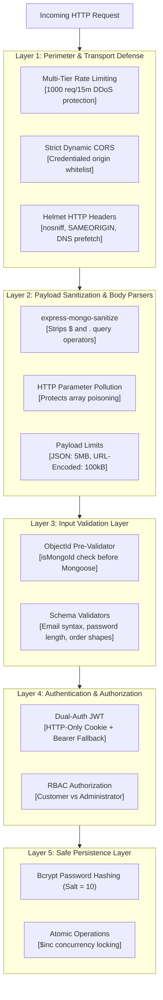
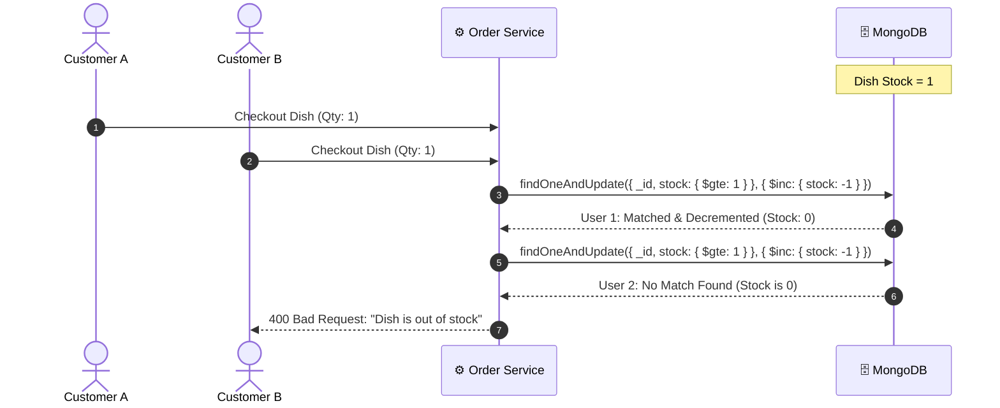

# 🛡️ SmartCraving Security Architecture & Hardening Guide

---

## 1. Security Architecture (Defense-in-Depth)

---

## 2. OWASP Top 10 Mitigations Implemented

### 2.1 Injection Defense (A03:2021)
- **NoSQL Operator Sanitization**: `express-mongo-sanitize` strips `$` and `.` operators from `req.body`, `req.query`, and `req.params`. Payloads like `{ "email": { "$gt": "" } }` are completely neutralized.
- **ObjectId Validation**: `validateObjectId` runs before any MongoDB query. Malformed hexadecimal strings immediately return `400 Bad Request` rather than triggering internal database driver exceptions.

### 2.2 Broken Authentication (A07:2021)
- **Dual-Auth Token Architecture**: Issues signed JWTs inside `httpOnly`, `secure` (in production), and `sameSite` cookies to prevent XSS exfiltration. For cross-domain payment redirects (e.g. Stripe Hosted Checkout), the frontend Axios client falls back to an `Authorization: Bearer <token>` header.
- **Brute-Force Rate Limiting**: `/api/v1/users/login` and `/api/v1/users/signup` are limited to **15 attempts per 15 minutes per IP**.

### 2.3 Broken Access Control (A01:2021)
- **Role-Based Access Control (RBAC)**: All administrative routes (`/admin/*`, `/stores` write operations, `/item` write operations) require the `authorizeRoles("admin")` middleware.
- **Customer Ownership Enforcement**: Order history queries (`/api/v1/eats/orders/me/myOrders`) strictly bind to `req.user.id`, preventing horizontal privilege escalation.

### 2.4 Denial of Service & Resource Exhaustion (A04:2021)
- **Multi-Tier Rate Limiting**:
  - `globalLimiter`: 1000 requests per 15 minutes.
  - `orderCreationLimiter`: 15 orders per 10 minutes on `/api/v1/eats/orders/new`.
  - `cartLimiter`: 100 cart operations per 10 minutes.
  - `aiLimiter`: 10 AI operations per 15 minutes.

### 2.5 Security Misconfiguration (A05:2021)
- **HTTP Security Headers (`helmet`)**:
  - `X-Content-Type-Options: nosniff` (stops MIME sniffing).
  - `X-Frame-Options: SAMEORIGIN` (mitigates clickjacking).
  - `X-DNS-Prefetch-Control: off`.
- **Environment Isolation**: Production runs strictly enforce validated variables via `src/config/env.js`.

---

## 3. Concurrency & Inventory Protection

Inventory adjustments are performed atomically using conditional `$gte` criteria and `$inc` operators, completely eliminating double-ordering race conditions without expensive distributed database locking.
