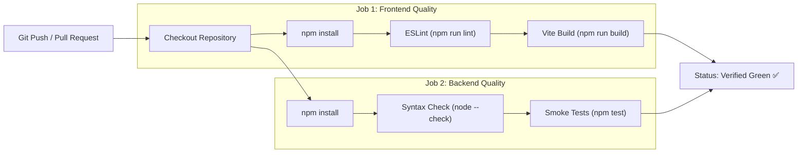

# 🚀 SmartCraving CI/CD & Quality Automation

[](#)
[](#)

---

## 1. Automated Pipeline Overview

The CI pipeline runs automatically on every **Push** and **Pull Request** targeting the `main` branch via `.github/workflows/ci.yml`.



---

## 2. Pipeline Execution Steps

### 2.1 Frontend Verification
1. **ESLint Validation**: Ensures clean component code, valid hooks rules, and zero unhandled imports (`npm run lint`).
2. **Production Bundle Verification**: Compiles production assets via `vite build`, validating that all route chunks and Rollup manual chunks build without errors.

### 2.2 Backend Verification
1. **JavaScript Syntax Verification**: Executes `node --check` across all core, provider, and module files to catch syntax errors before runtime.
2. **Automated Smoke Test Suite**: Executes `node tests/smoke.test.js` covering Express initialization, config loading, provider factories, promotion calculations, HTTP headers (Helmet), NoSQL input validation, and in-memory cache operations.

---

## 3. Local Pre-Commit Checks

Run these commands locally prior to pushing changes:

```bash
# Frontend checks
cd frontend
npm run lint
npm run build

# Backend checks
cd ../backend
npm test
```
